# mra.py 论文结构图方案与草稿

## 1. 目标

本文中的 `mra.py` 适合采用“`1 张总流程图 + 3 张子模块图`”的结构化画法。

推荐的图组如下：

1. `图 1 总体框架图`：展示从原始多采样率数据到最终异常判定的完整流程。
2. `图 2 双专家门控插补模块图`：展示预插补、图专家、频域专家、门控融合的关系。
3. `图 3 图学习 GCN 专家图`：展示动态图构建和图卷积重构过程。
4. `图 4 采样率感知 Transformer 检测器图`：展示采样率编码、相位编码与时间步 token 构造。

其中正文最重要的是 `图 1`。如果版面有限，正文保留 `图 1 + 图 2`，其余两张可以放方法部分或附录。

---

## 2. 画图总原则

### 2.1 不建议一张图塞完所有细节

这个模型同时包含：

- 多采样率建模
- 缺失值插补
- 图学习
- 频域建模
- Transformer 异常检测
- 多源分数融合与后处理

如果把所有内部细节全部放入一张图，结构会非常拥挤，论文阅读体验会很差。因此建议：

- 总图只强调“数据流”和“模块级关系”
- 子图再展开“模块内部计算”

### 2.2 训练和推理要分开画

该模型训练期和测试期差别明显：

- 训练期有 `holdout mask`
- 训练期有五项联合损失
- 测试期有多源分数融合、EWAF、阈值化和最短异常时长约束

所以总图建议使用两条泳道：

- 上方：`Training`
- 下方：`Inference`

### 2.3 明确三个掩码/状态

论文图里最容易混淆的是掩码。建议明确写出：

- `Ms`：结构性缺失掩码
- `Mh`：训练期随机 holdout 掩码
- `Mmodel = max(Ms, Mh)`：模型实际输入缺失掩码

这样你在论文里解释训练机制会更顺。

---

## 3. 图 1 总体框架图设计

## 3.1 图 1 的核心任务

图 1 只回答一个问题：

`整个模型从输入到输出到底经历了哪些阶段？`

因此总图建议划分为 6 个阶段：

1. 数据预处理
2. 多采样率元数据构造
3. 双专家门控插补
4. 采样率感知异常检测
5. 多源异常分数融合
6. 后处理与判定

## 3.2 图 1 每个框建议怎么写

### 阶段 A：输入与预处理

- `Raw multirate series X_raw`
- `Structural missing mask Ms`
- `Observed-value standardization`
- `Sliding window construction`

补充标注：

- 默认数据维度：`4100 x 18`
- 窗口长度：`L = 50`

### 阶段 B：多采样率元数据

- `Sampling-rate inference from training missing ratios`
- 输出两个量：
  - `rate_id`
  - `stride`

在你的默认数据下，可以在图旁边标注：

- Group 1: variables 1-6, stride = 1
- Group 2: variables 7-12, stride = 3
- Group 3: variables 13-18, stride = 5

### 阶段 C：双专家门控插补

- `Pre-imputation seed generation`
- `Graph GCN expert`
- `Frequency-domain expert`
- `Rate-aware gating fusion`
- `Completed window X_complete`

### 阶段 D：异常检测器

- `Sampling-aware Transformer encoder`
- `Window reconstruction`
- `Detector reconstruction error`

### 阶段 E：多源分数融合

- `detector_score`
- `disagreement_score`
- `shift_score`
- `score combination`

说明：

- `gate_entropy` 可作为分析指标，但不建议画进最终判定主线

### 阶段 F：后处理与输出

- `EWAF smoothing`
- `Threshold selection from training scores`
- `Minimum anomaly duration filtering`
- `Final anomaly prediction`

---

## 4. 图 2 双专家门控插补模块设计

这张图是方法部分最值得展开的一张。

建议主线如下：

1. 输入：`x_input` 和 `Mmodel`
2. 经过 `PreImpute.fill` 生成 `x_seed`
3. `x_seed` 同时送入两个专家：
   - 图专家输出 `x_gcn`
   - 频域专家输出 `x_freq`
4. 门控网络输入以下特征：
   - `x_seed`
   - `Mmodel`
   - `x_gcn`
   - `x_freq`
   - `x_gcn - x_seed`
   - `x_freq - x_seed`
   - `rate embedding`
5. 门控输出 `w_gcn` 和 `w_freq`
6. 加权融合得到 `x_imputed`
7. 观测值直通，缺失位替换，得到 `x_complete`

建议在图边上配一个公式：

```text
x_imputed = w_gcn * x_gcn + w_freq * x_freq
x_complete = where(Mmodel = 1, x_imputed, x_input)
```

这张图的重点是突出：

- 图专家和频域专家是并行的
- 门控是位置相关、变量相关的
- 门控显式使用采样率嵌入

---

## 5. 图 3 图学习 GCN 专家设计

这张图建议只讲图专家内部，不再重复总流程。

建议拆成两段：

### 图构建段

- 输入：`x_seed`, `Mmodel`
- 窗口统计量提取：
  - mean
  - std
  - last observed value
  - missing ratio
- 与 `static context` 拼接
- 得到 `node representation`
- 两两节点组合后经过 `edge MLP`
- 与以下先验融合：
  - `distance prior`
  - `cosine similarity`
- 经过 `softmax + symmetrization + row normalization`
- 输出 `adaptive adjacency A`

### 图卷积重构段

- `A + x_seed`
- `GCN layer 1`
- `GCN layer 2`
- `GCN output layer`
- 输出 `x_gcn`

这张图最关键的一句话建议直接写在图注里：

`The adjacency matrix is dynamically generated for each window rather than fixed globally.`

---

## 6. 图 4 频域专家设计

建议主线如下：

1. `x_seed`
2. 按变量维做 `FFT`
3. 拆成 `real` 和 `imag`
4. 拼接后送入两个分支：
   - `frequency attention`
   - `frequency enhancement`
5. 形成复数频谱残差
6. `iFFT`
7. `output head`
8. 输出 `x_freq`

图注里建议强调：

`Each variable is reconstructed independently in the frequency domain, and the enhanced spectrum is mapped back to time space by inverse FFT.`

---

## 7. 图 5 采样率感知 Transformer 检测器设计

建议主线如下：

1. 输入：`x_complete`, `observed mask`, `rate_id`, `stride`
2. 逐变量构造特征：
   - value
   - observed mask
   - variable embedding
   - rate embedding
   - phase embedding
3. `per-variable projection`
4. 拼接全部变量特征，形成 `time-step token`
5. `token projection + positional encoding`
6. `Transformer encoder`
7. `reconstruction head`
8. 输出 `x_hat`
9. 与 `x_complete` 比较得到 `detector_score`

一定要明确：

- token 是“时间步 token”
- 不是“变量 token”

这是你这套检测器和很多图时序模型很不一样的地方。

---

## 8. 总图草稿建议

下面给出一版适合论文初稿的 Mermaid 草稿。它更接近“画图脚本”，你后续可以据此用 Visio、draw.io、PowerPoint 或 Illustrator 重绘。

```mermaid
flowchart LR
    subgraph A[Input and Preprocessing]
        X[Raw multirate series X_raw]
        Ms[Structural missing mask M_s]
        S[Observed-value standardization]
        W[Sliding windows]
        X --> S
        Ms --> S
        S --> W
    end

    subgraph B[Sampling Metadata]
        R[Infer rate_id and stride<br/>from training missing ratios]
    end

    subgraph C[Two-Expert Gated Imputation]
        Xin[x_input]
        Mmodel[Model missing mask M_model]
        P[PreImpute<br/>bidirectional temporal fill]
        G1[Graph GCN expert]
        F1[Frequency-domain expert]
        Gate[Rate-aware gating network]
        Imp[x_imputed]
        Comp[x_complete]

        Xin --> P
        Mmodel --> P
        P --> G1
        P --> F1
        P --> Gate
        G1 --> Gate
        F1 --> Gate
        Gate --> Imp
        G1 --> Imp
        F1 --> Imp
        Xin --> Comp
        Imp --> Comp
    end

    subgraph D[Sampling-Aware Transformer Detector]
        T1[Sampling-aware feature encoding<br/>value + mask + variable emb + rate emb + phase emb]
        T2[Time-step token projection<br/>+ positional encoding]
        T3[Transformer encoder]
        T4[Reconstruction head]
        Xhat[Window reconstruction]
        Comp --> T1 --> T2 --> T3 --> T4 --> Xhat
    end

    subgraph E[Score Construction]
        DS[detector_score]
        DIS[disagreement_score]
        SH[shift_score]
        FS[final score]
        Xhat --> DS
        G1 --> DIS
        F1 --> DIS
        Comp --> SH
        DS --> FS
        DIS --> FS
        SH --> FS
    end

    subgraph F[Post-processing]
        EW[EWAF smoothing]
        TH[Threshold selection]
        MD[Minimum anomaly duration filtering]
        Y[Final anomaly prediction]
        FS --> EW --> TH --> MD --> Y
    end

    W --> Xin
    W --> Mmodel
    W --> R
    R --> Gate
    R --> T1
```



---

## 9. 训练版总图草稿

如果你希望总图更突出训练机制，可以再加一版训练图，只讲训练期：

```mermaid
flowchart LR
    Xtrue[Training window x_true] --> Mh[Random holdout mask M_h]
    Ms[Structural missing mask M_s] --> Mmodel[M_model = max(M_s, M_h)]
    Mh --> Mmodel
    Xtrue --> Xin[x_input = mask fill with 0]
    Mmodel --> Xin

    Xin --> Model[FusionAnomalyModel]
    Mmodel --> Model
    Ms --> Model
    Rate[rate_id, stride] --> Model

    Model --> Xgcn[x_gcn]
    Model --> Xfreq[x_freq]
    Model --> Ximp[x_imputed]
    Model --> Xcomp[x_complete]
    Model --> A[Adjacency A]
    Model --> Xhat[Detector reconstruction]

    Ximp --> L1[fusion_loss]
    Xgcn --> L2[gcn_loss]
    Xfreq --> L3[freq_loss]
    A --> L4[graph_loss]
    Xhat --> L5[detector_loss]

    Xtrue --> L1
    Xtrue --> L2
    Xtrue --> L3
    Xcomp --> L5
    Mh --> L1
    Mh --> L2
    Mh --> L3
    Ms --> L5

    L1 --> LT[Total loss]
    L2 --> LT
    L3 --> LT
    L4 --> LT
    L5 --> LT
    LT --> OPT[AdamW optimization]
```

---

## 10. 推荐的正式论文配色与版式

为了后面重绘更像论文图，不像代码流程图，建议统一视觉规范：

- 预处理模块：浅灰或浅蓝
- 插补模块：浅橙
- 图专家：浅绿
- 频域专家：浅黄
- Transformer 检测器：浅紫灰
- 分数融合与后处理：浅红或浅棕

版式建议：

- 总图用横向布局
- 模块图用纵向或左右两段布局
- 实线表示主数据流
- 虚线表示辅助元数据或训练监督
- 损失项统一用六边形或圆角框表示

---

## 11. 论文写作时可直接配套的图注表述

### 图 1 图注

`Overall framework of the proposed MRA model. The model first standardizes multirate incomplete sequences and infers sampling metadata, then performs two-expert gated imputation with a graph GCN expert and a frequency-domain expert, and finally feeds the completed windows into a sampling-aware Transformer detector for anomaly scoring and decision making.`

### 图 2 图注

`Architecture of the two-expert gated imputation module. A bidirectional temporal pre-imputation seed is sent to the graph expert and the frequency expert in parallel, while the gating network adaptively fuses their outputs with explicit sampling-rate embeddings.`

### 图 3 图注

`Architecture of the graph learning and GCN reconstruction expert. The adjacency matrix is dynamically generated for each window from node statistics, learned static context, and distance priors, and is then used for graph convolutional reconstruction.`

### 图 4 图注

`Architecture of the sampling-aware Transformer detector. For each time step, variable-wise features are constructed from values, observation masks, variable embeddings, rate embeddings, and phase embeddings, and then aggregated into a time-step token for Transformer-based reconstruction.`

---

## 12. 最后建议

如果现在只先画一张图，优先顺序应为：

1. 先画 `总流程图`
2. 再画 `双专家门控插补图`
3. 最后视篇幅补 `图学习专家图` 和 `Transformer 图`

原因很简单：

- 总图负责让审稿人一眼知道你方法做了什么
- 门控插补图负责体现你的核心创新组合
- 图专家图和 Transformer 图负责支撑方法细节

对于当前 `mra.py`，最应强调的创新表达不是“单独的 GCN”或“单独的 FFT”，而是：

`多采样率元数据驱动的双专家门控插补 + 采样率感知 Transformer 检测`
